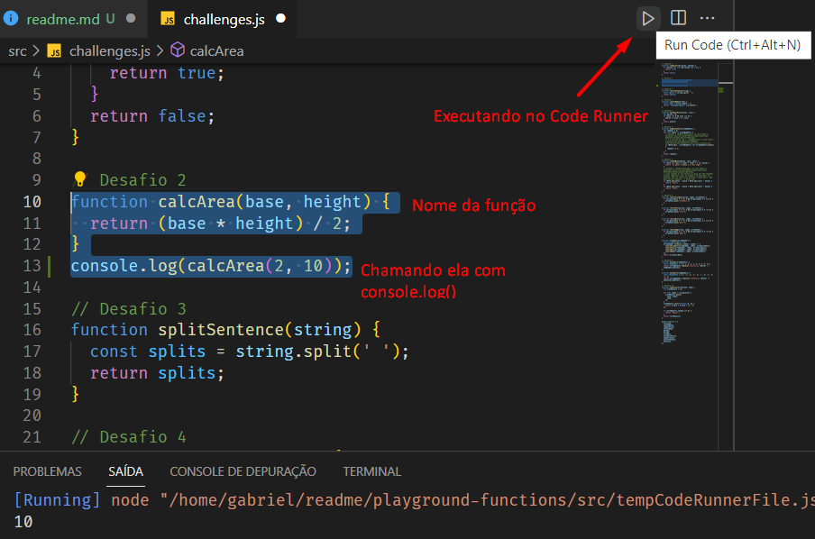

# Boas vindas ao repositório do projeto <b>Playground Functions</b>!

Esse projeto foi desenvolvido durante o módulo de Fundamentos na Trybe! #vqv 

Aqui você vai encontrar os detalhes de como foi o desenvolvimento do projeto e quais foram os requisitos técnicos necessários para a entrega do desafio.

---

# Habilidades desenvolvidas

Neste projeto, fui capaz de:

- Escrever códigos em JavaScript que usam variáveis e tipos primitivos;
- Utilizar conceitos da linguagem como a tipagem dinâmica e operadores lógicos/aritméticos/de atribuição no seu código;
- Criar códigos que usam estruturas condicionais, como o `if/else`;
- Manipular arrays (listas);
- Utilizar o comando `for`;
- Quebrar grandes problemas em pequenos;
- Utilizar a lógica de programação na resolução de problemas;
- Manipular objetos;
- Utilizar o comando `for/in`;
- Utilizar funções para organizar e estruturar o seu código;

---

# Funcionamento da aplicação

Para iniciar o projeto, é necessário rodar o comando
```
npm install
```
para que as dependências do projeto sejam instaladas.

O projeto se divide em dois arquivos: `challenges1.js` e `challenges2.js`. Cada arquivo conta com funções diferenciadas, as quais podem ser testadas através da chamada delas. É possível visualizar o retorno de cada função ao utilizar o comando `console.log()` para chamá-las.

## Exemplo:

Escolha uma função para testar. Abaixo dela, a execute com o comando `console.log()`, passando os parâmetros necessários para a execução da função.
Para verificar o retorno da função no terminal, você pode instalar a extensão `Code Runner` no Visual Studio Code. Assim, você seleciona todo o código da função e clica no botão `Run Code`, conforme imagem abaixo:



---

# Requisitos técnicos do desafio:

- ✅ 1. Crie uma função usando o operador &&.

- ✅ 2. Crie uma função que calcule a área de um triângulo.

- ✅ 3. Crie uma função que divida a frase.

- ✅ 4. Crie uma função que use concatenação de strings.

- ✅ 5. Crie uma função que calcule a quantidade de pontos no futebol.

- ✅ 6. Crie uma função que calcule a repetição do maior número.
  
- ✅ 7. Crie uma função de Caça ao rato.

- ✅ 8. Crie uma função FizzBuzz.

- ✅ 9. Crie uma função que Codifique e Decodifique.

- ✅ 10. Crie uma função de Lista de tecnologias.

--- 

# REQUISITOS BÔNUS

- ✅ 11. Crie uma função de Número de telefone.

- ✅ 12. Crie uma função de Condição de existência de um triângulo.

- ✅ 13. Crie uma função de Boas Vindas ao Bar da Trybe!
